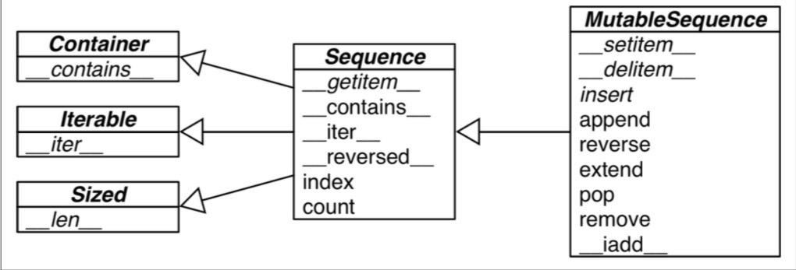

# Chapter 2 Array of Sequence



## List Comprehensions and Generator Expressions
```python
[ord(symbol) for symbol in symbols] # list comprehension 不应该被用于构建list以外的地方。
[(color, size) for color in colors 
               for size in sizes] # 可以用来形成笛卡尔积
(ord(symbol) for symbol in symbols) # 生成器
('%s %s' % (c, s) for c in colors for s in sizes) # 生成器可以笛卡尔积
```
## Tuples Are Not Just Immutable Lists
**tuple**不只是 不可调换顺序的list。很多时候**tuple**被用来当做没有领域名称的记录。改变**tuple**的顺序会破坏其含义。
```python
city, year, pop, chg, area = ('Tokyo', 2003, 32450, 0.66, 8014) # 这叫 unpacking
'%s/%s' % (a, b) # 也是unpacking  
```

下面两种函数调用等价
```python
divmod(20, 8)
t = (20, 8)
divmod(*t)
```

可以unpack 0-n个元素
```python
*s, a, b= [1,2,3,4,5]
s,a,b
([1,2,3], 4, 5)
```

namedtuple
```python
Card = collections.namedtuple('Card', ['rank', 'suit'])
```

## Slicing
三种slicing的方式等价
```python
seq[slice(a,b,c)] # a start b stop c step
seq[a:b:c] 
seq.__getitem__(slice(a,b,c))
```
多维slicing的原理是使用了tuple
```python
seq[a,b,c] # 三个维度 
seq.__getitem__((a,b,c))
```

## Using + and * with Sequences

## Augmented Assignment with Sequences
表达式
```python
a += b
```
调用接口
```python
a.__iadd__(b)
```
如果该接口没有实现则调用
```python
a = a.__add__(b)
```
对于可变序列使用**__iadd__**比**__add__**合适，对于不可变序列，只能用**__add__**实现。

`不要将可变对象嵌套进不可变对象，python操作不是原子操作`

## Managing Ordered Sequences with bisect
bisect 查找有序数列中的位置
一个巧用是
```python
def grade(score, breakpoints=[60, 70, 80, 90], grades='FDCBA'):
    i = bisect.bisect(breakpoints, score)
    return grades[i]
# 调用时分数会被插入到分数节点中，选择然后根据插入位置返回等级
> grade(70)
> 'C'
```
bisect.insort 则是insert 并保持序列sorted

## When a List Is Not the Answer
虽然list很好用，但是在特别的时刻应该选择一些其他队列类型。
### Arrays
数据按照bytes流存储，在大数组时可以节约空间。

### Memory Views
比特流，可以按不同格式（比如不同位整数）解析。

### Deques and Other Queues
各种队列，删除从头尾增减，不擅长从中间删减
#### queue 
队列
#### heapq
堆
