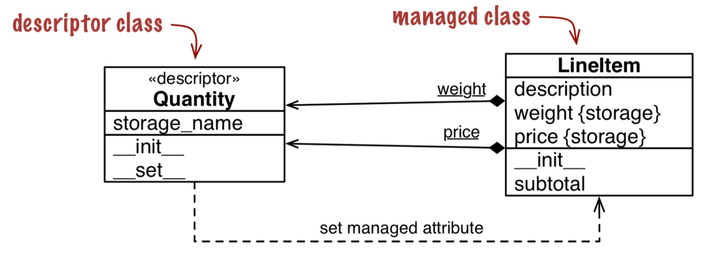
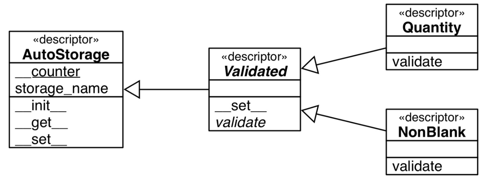

# CHAPTER 20 Attribute Descriptors

`Descriptors`是一种复用相同逻辑获取多属性的方式。Django ORM 和 SQLAlchemy就大量使用了`descriptors`
## Descriptor Example: Attribute Validation

本节中的`descriptor`叫做覆盖式(override)`descriptor`因为它重写了`__set__`和`__get__`方法。

### LineItem Take #3: A Simple Descriptor
一个实现了`__get__`, `__set__`或者`__delete__`的类就是一个`descriptor`。



`weight`和`price`出现了两次，一次是作为`LineItem`的属性，另一次是`descriptor`的一个实例。还有要注意，`Quantity`是`LIneItem`的类方法。

```python
class Quantity:
    def __init__(self, storage_name):
        self.storage_name = storage_name
    def __set__(self, instance, value): 
        if value > 0:
            instance.__dict__[self.storage_name] = value  # 防止无限循环所以需要直接操作字典。
        else:
            raise ValueError('value must be > 0')

class LineItem:
    weight = Quantity('weight') 
    price = Quantity('price')
```
> 要注意，`self`是`Quantity`类，`instance`是`LineItem`类。`LineItem`可以有成百上千个实例，而`Quantity`只有两个实例。

### LineItem Take #4: Automatic Storage Attribute Names
上例需要显示的指明`Quantity('weight')`中的名字,如果前后名称不一致可能会引起奇怪的行为。而如果用唯一字符存储名称，并且自己实现`__set__`和`__get__`方法可以解决这个问题。

```python
class Quantity: 
    __counter = 0
    def __init__(self):
        cls = self.__class__ 
        prefix = cls.__name__ 
        index = cls.__counter
        self.storage_name = '_{}#{}'.format(prefix, index)
        cls.__counter += 1
    def __get__(self, instance, owner): # Owner是LineItem类, Instance是LineItem实例
        if instance is None:
            return self # 如果直接从类调用比如`LineItem.weight`，Instance会为None。
        else:
            return getattr(instance, self.storage_name)  
    def __set__(self, instance, value): 
        if value > 0:
            setattr(instance, self.storage_name, value)  # 因为quantity 名称和 storage_name不同所以可以不用直接操作字典。
        else:
            raise ValueError('value must be > 0')
```

相比`property`, `descriptors`更为灵活，复用更容易，所以使用也更广泛。

### LineItem Take #5: A New Descriptor Type



## Overriding Versus Nonoverriding Descriptors

类的实例读取数据会先查看实例是否有此变量名，然后查看类是否有此变量，但是设定变量值则不会和类中的变量名发生关系。所以`descriptor`可以依照是否定义了`__set__`方法，分成两种类型。
```python
class Managed:
    over = Overriding() 
    over_no_get = OverridingNoGet()
    non_over = NonOverriding()
    def spam(self):
        print('-> Managed.spam({})'.format(display(self)))
```

### Overriding Descriptor
```python
class Overriding:
    """a.k.a. data descriptor or enforced descriptor"""
    def __get__(self, instance, owner):  # Managed.over会覆盖instance.over方法
        print_args('get', self, instance, owner) # self: overiding obj, instance: managed instance, owner: managed class
    def __set__(self, instance, value): 
        print_args('set', self, instance, value) # self: overiding obj, instance: managed instance, value: set value 
```


### Overriding Descriptor Without `__get__`
```python
class OverridingNoGet:
    """an overriding descriptor without ``__get__``"""
    def __set__(self, instance, value): 
        print_args('set', self, instance, value) # 只覆盖了__set__方法，行为和上面一样，除了instance.over_no_get是直接取值。
```

### Nonoverriding Descriptor
```python
class NonOverriding:
    """a.k.a. non-data or shadowable descriptor"""
    def __get__(self, instance, owner): # 此时对intance设置会覆盖此方法。
        print_args('get', self, instance, owner)

```
### Overwriting a Descriptor in the Class

如果对类变量赋值，则会覆盖类变量中的`descriptor`

## Methods Are Descriptors

类中的方法（函数）就是一种非覆盖式`descriptor`。
```python

class Text(collections.UserString):
    def __repr__(self):
        return 'Text({!r})'.format(self.data)
    def reverse(self): 
        return self[::-1]
```

所以有：

```python
>>> word = Text('forward')
>>> Text.reverse.__get__(word) # instance 不为 None 取到方法
<bound method Text.reverse of Text('forward')>
>>> Text.reverse.__get__(None, Text) # instance 为 None 取到方程
<function Text.reverse at 0x101244e18>

```

## Descriptor Usage Tips

- 使用`property`可以自动构建一个`descriptor`，设置其值会报错。

- 只读`descriptor`也要设置`__set__`防止其被覆盖。

- 验证`descriptor`只用`__set__`就可以了。

- 缓存`descriptor`可以只写`__get__`方法。第一次计算完成后，缓存会自动覆盖，之后就不需要昂贵的计算了。

- 方程一类的特殊方法可以在实例中覆盖。

## Descriptor docstring and Overriding Deletion

相比`property`,`descriptor`也可以增加`__delete__`方法，不过为其增加注释会比较困难。


## 自己两个问题
- 类方法会覆盖实例的方法？
- `descriptor`调用变量会有`instance`和`class`
