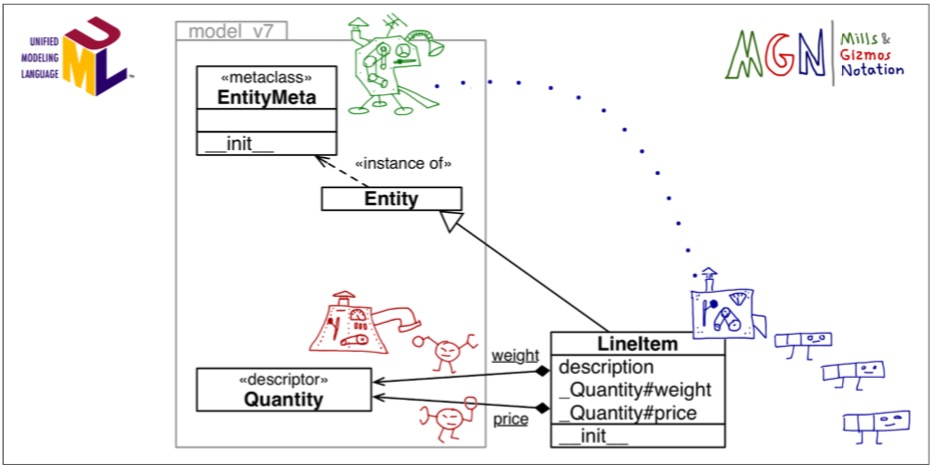

# CHAPTER 21 Class Metaprogramming

> 元编程超过了99%的编程者的需求。如果你不知道自己需要它，那你肯定不需要。

类元编程的主要作用是在运行时实时生成类。方程可以在运行时返回一个类，装饰器可以改变一个类，元编程可以帮助我们构建一整个簇的类。拥有各种性质。

> 除非进行python框架相关的工作，不然不要使用元编程。

## A Class Factory

一个典型的例子就是`collecitons.namedtuple`。

```python
def record_factory(cls_name, field_names): 

    try:
        field_names = field_names.replace(',', ' ').split() 
    except AttributeError: # no .replace or .split
        pass # assume it's already a sequence of identifiers 
    field_names = tuple(field_names)

    def __init__(self, *args, **kwargs):
        attrs = dict(zip(self.__slots__, args)) 
        attrs.update(kwargs)
        for name, value in attrs.items():
            setattr(self, name, value)

    def __iter__(self):
        for name in self.__slots__:
        yield getattr(self, name)

    def __repr__(self):
        values = ', '.join('{}={!r}'.format(*i) for i in zip(self.__slots__, self)) 
        return '{}({})'.format(self.__class__.__name__, values)

    cls_attrs = dict(__slots__ = field_names,
                     __init__  = __init__,
                     __iter__  = __iter__,
                     __repr__  = __repr__)

    return type(cls_name, (object,), cls_attrs) # 建造并返回一个新的类型，其

```

这里`type`是一个类，用来生成其他类，调用方法为
```python
MyClass = type('MyClass', (MySuperClass, MyMixin), {'x': 42, 'x2': lambda self: self.x * 2})
```
不过这个方法有个致命问题，生成的类无法序列化，为了解决这个问题，可以研究`collections.nameduple` 和 `pickle`

### A Class Decorator for Customizing Descriptors

和上面的`descriptor`一样，不过改变存储单元的名字。
```python
@entity
class LineItem:
    description = model.NonBlank() 
    weight = model.Quantity() 
    price = model.Quantity()

def entity(cls):
    for key, attr in cls.__dict__.items():
    if isinstance(attr, Validated):
        type_name = type(attr).__name__
        attr.storage_name = '_{}#{}'.format(type_name, key)
    return cls
```

类装饰器可以一定程度上代替元类，不过，他们不会对子类起作用。

## What Happens When: Import Time Versus Runtime
### The Evaluation Time Exercises

#### `import` 
- 我的结果:
100 400 700 1 2 6 7 `9 200` 14
- 答案：
100 400 700 1 2 6 7 `200 9` 14

> 先运行decorator 函数后运行下一个类的创建。

#### 运行脚本
- 我的结果:
100 400 700 1 2 6 7 200 9 11 3 5 12 300 13 10 14  
- 答案：
100 400 700 1 2 6 7 200 9 11 3 5 12 300 13 10 14 `4`

> `__del__` 在类销毁时会运行。

## Metaclasses 101
类生产实例。
元类生产类。
python中的类包括`type`本身的元类都是`type`。这个关系和继承关系是不同的，是类似类和实例的关系。

> `type`是`object`的一个子类。`object`是`type`的一个实例。

标准库中还有其他元类比如`Enum`他们既是`type`的实例，又是`type`的子类，继承了`type`建造类的能力。

### The Metaclass Evaluation Time Exercise

#### `import` 
- 我的结果:
100 400 700 1 2 200 4 `500 6 500 9` 15 
- 答案：
100 400 700 1 2 200 4 `6 500 9 500` 15

> 先构建类，然后运行元类中的`__init__`。Python解释器，先评估类然后使用元类而不是`type`来构建类。

#### 运行脚本
- 我的结果:
100 400 700 1 2 200 4 6 500 9 500 11 300 12 5 13 7 600 14 7 600 15
- 答案：
一样。

> 元类和装饰器不同，所有子类都会继承设定。

## A Metaclass for Customizing Descriptors

```python
class EntityMeta(type):
    """Metaclass for business entities with validated fields"""
    def __init__(cls, name, bases, attr_dict):
        super().__init__(name, bases, attr_dict) 
        for key, attr in attr_dict.items():
            if isinstance(attr, Validated):
                type_name = type(attr).__name__
                attr.storage_name = '_{}#{}'.format(type_name, key)

class Entity(metaclass=EntityMeta): """Business entity with validated fields"""
```



## The Metaclass `__prepare__` Special Method

`__prepare__`方法是`MetaClass`的一个类方法，这个方法在`__new__`之前被调用。

## Classes as Objects

- `cls.__bases__`: 此类基类的元包
- `cls.__qualname__`: 此类的全称（包括所属空间类）
- `cls.__subclasses__()`: 此类在内存中的子类
- `cls.mro()`: 

